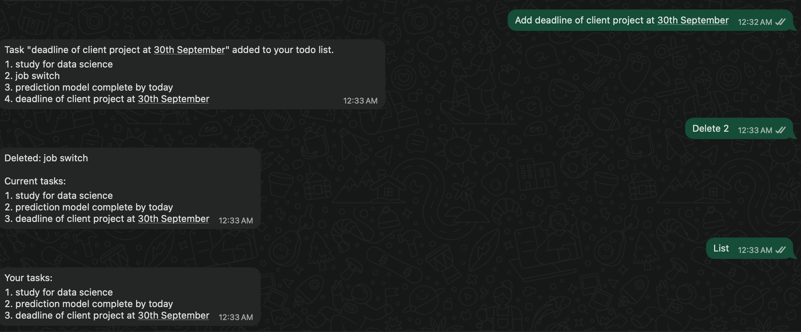

WhatsApp To-Do Bot

A simple WhatsApp To-Do list bot built using FastAPI and Twilio’s WhatsApp API.
You can add, list, and delete tasks directly from WhatsApp.

Features

add <task> → Add a new task

list → Show all tasks

delete <number> → Delete a task by its index

Requirements

Python 3.11+

A Twilio account with WhatsApp Sandbox activated

Ngrok or Cloudflared (for exposing localhost)

A .env file with Twilio credentials

Installation

Clone the repository

git clone <your-repo-url>
cd whatsappbot

Create virtual environment & activate

python3 -m venv env
source env/bin/activate

Install dependencies

pip install fastapi uvicorn python-dotenv twilio python-multipart

Create a .env file in the project root:

TWILIO_ACCOUNT_SID=ACXXXXXXXXXXXXXXXXXXXXXXXX
TWILIO_AUTH_TOKEN=your_auth_token
TWILIO_WHATSAPP_NUMBER=whatsapp:+14155238886   # Twilio sandbox number
PERSONAL_NUMBER=whatsapp:+91XXXXXXXXXX        # Your personal WhatsApp number

Running the Bot

Start FastAPI server

uvicorn main:app --reload

Server runs at http://127.0.0.1:8000
.

Expose local server

Using ngrok:

ngrok http 8000

or using cloudflared:

cloudflared tunnel --url http://localhost:8000

Copy the generated public URL (e.g. https://xxxxx.trycloudflare.com).

Configure Twilio webhook

In Twilio Console > WhatsApp Sandbox Settings
,
set the WHEN A MESSAGE COMES IN webhook URL to:

https://<your-public-url>/webhook

Usage

Notes

Tasks are stored in memory (they reset if the server restarts).

For persistence, connect to a database (SQLite, Postgres, MongoDB, etc.).

Twilio Sandbox number is shared; use your personal number in .env for testing.